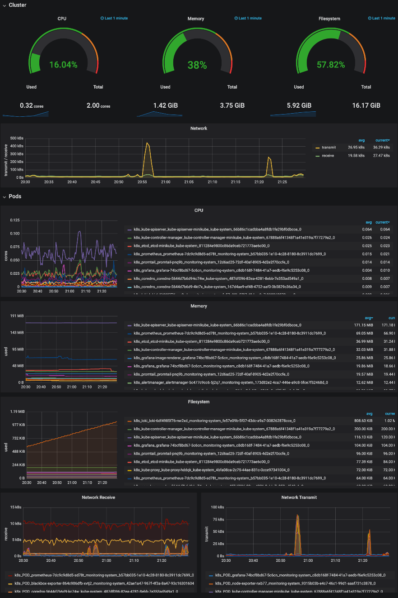

# Kubernetes Monitoring

> A simple Kubernetes monitoring stack without Helm or Jsonnet.

I wanted an easy-to-deploy monitoring solution for Kubernetes with a simple Grafana dashboard, a few
Alertmanager alerts, and built-in logging.

There's a few repositories similar to this one on GitHub, but most of them haven't been updated in
2-3 years. I started with [`giantswarm/prometheus`](https://github.com/giantswarm/prometheus) (which
itself is based on [`kayrus/prometheus-kubernetes`](https://github.com/kayrus/prometheus-kubernetes)).

## Features

### Monitoring

  - [`grafana`](https://github.com/grafana/grafana)
  - [`prometheus`](https://github.com/prometheus/prometheus)
  - [`node_exporter`](https://github.com/prometheus/node_exporter)
  - [`blackbox_exporter`](https://github.com/prometheus/blackbox_exporter)
 
### Alerting

  - [`alertmanager`](https://github.com/prometheus/alertmanager)

### Logging

  - [`loki`](https://github.com/grafana/loki)
  - [`promtail`](https://github.com/grafana/loki/blob/v1.0.0/docs/clients/promtail/README.md)

### Dashboard



## Instructions

```bash
# Install dependencies
brew install minikube kubernetes-cli just
brew cask install virtualbox

# Install optional helpers
brew install kubectx stern

# Start minikube
minikube start --vm-driver=virtualbox --cpus=2 --memory=4g --disk-size=10g

# Deploy
just deploy
```

## Usage

There are 3 web-based interfaces in this stack: Grafana, Prometheus, and Alertmanager.

All are unauthenticated, so they aren't meant to be exposed publically. Instead, they are meant to
be accessed via port forwarding.

```bash
# http://localhost:3000
kubectl -n monitoring-system port-forward svc/grafana 3000:3000

# http://localhost:9090
kubectl -n monitoring-system port-forward svc/prometheus 9090:9090

# http://localhost:9093
kubectl -n monitoring-system port-forward svc/alertmanager 9093:9093
```

You could use something like [`kubefwd`](https://github.com/txn2/kubefwd) or [`click`](https://github.com/databricks/click)
to make this easier:

```bash
brew install txn2/tap/kubefwd

# You must run kubefwd as root
sudo kubefwd svc -n monitoring-system -l 'app in (grafana,prometheus,alertmanager)'
```

## Metrics

The following metrics are used either in Alertmanager or Grafana.

**node_exporter**:
  - `node_cpu_seconds_total`
  - `node_filesystem_size_bytes`
  - `node_filesystem_free_bytes`
  - `node_memory_SwapTotal_bytes`
  - `node_memory_SwapFree_bytes`
  - `node_memory_MemTotal_bytes`
  - `node_memory_MemFree_bytes`
  - `node_memory_Cached_bytes`

**blackbox_exporter**
  - `probe_success`
  - `probe_http_status_code`

**cAdvisor**
  - `container_cpu_usage_seconds_total`
  - `machine_cpu_cores`
  - `container_memory_working_set_bytes`
  - `machine_memory_bytes`
  - `container_network_receive_bytes_total`
  - `container_network_transmit_bytes_total`
  - `container_fs_usage_bytes`

## Updating ConfigMaps

If you change one of the configuration files and want to update the existing ConfigMap, use the
`update-configmap` script.

Using `grafana-dashboards` as an example:

```bash
just update-configmap grafana-dashboards
```

You can then restart the Deployment with `kubectl -n monitoring-system rollout restart deploy/grafana`.

## Storage

I'm using `emptyDir` for all storage, which is not persistent. You can easily add persistent storage
by creating a PersistentVolumeClaim for each resource.

For example, to store `/var/lib/grafana` in a PersistentVolume, create the following PVC:

```yaml
apiVersion: v1
kind: PersistentVolumeClaim
metadata:
  name: grafana
  namespace: monitoring-system
  finalizers: ["kubernetes.io/pvc-protection"]
  labels:
    app: grafana
spec:
  # `standard` is the default StorageClass in Minikube
  storageClassName: standard
  accessModes: ["ReadWriteOnce"]
  resources:
    requests:
      storage: 1Gi
```

Then update the Grafana Deployment manifest to use the PVC instead of the `emptyDir`.

```diff
volumes:
  - name: grafana
-   emptyDir: {}
+   persistentVolumeClaim:
+     claimName: grafana
```

## Cleanup

To remove all the resources created by the `deploy` script, run `just clean`.
